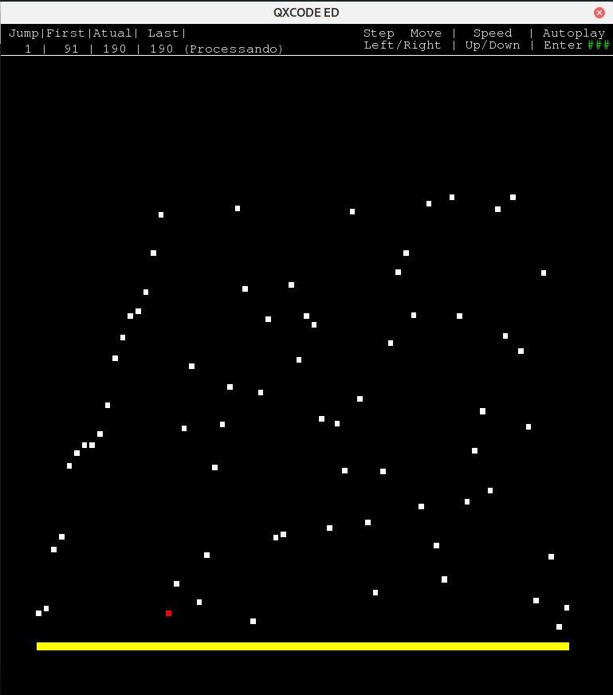
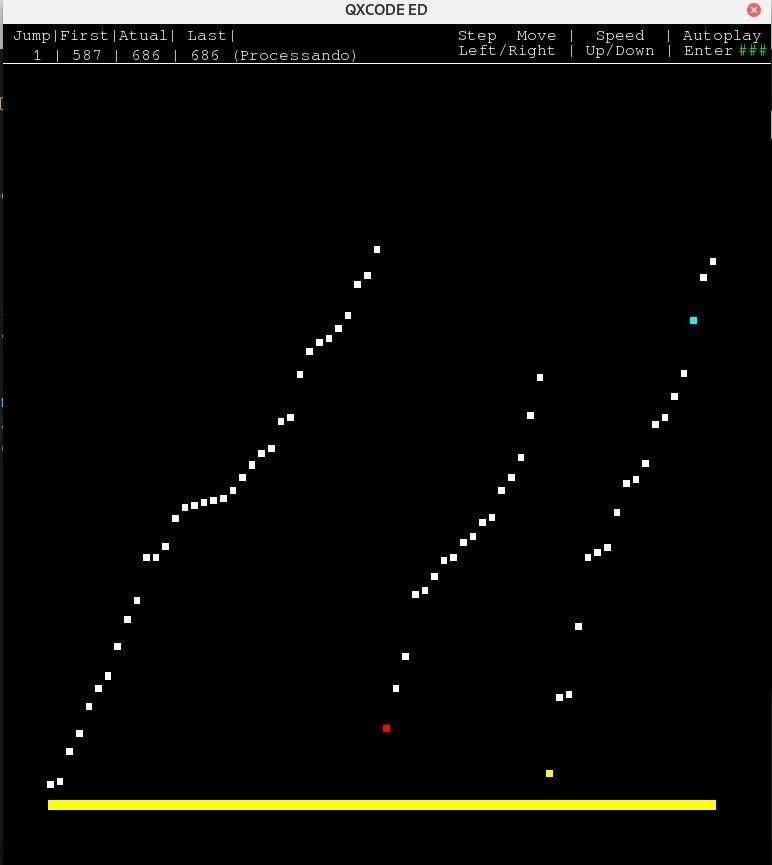
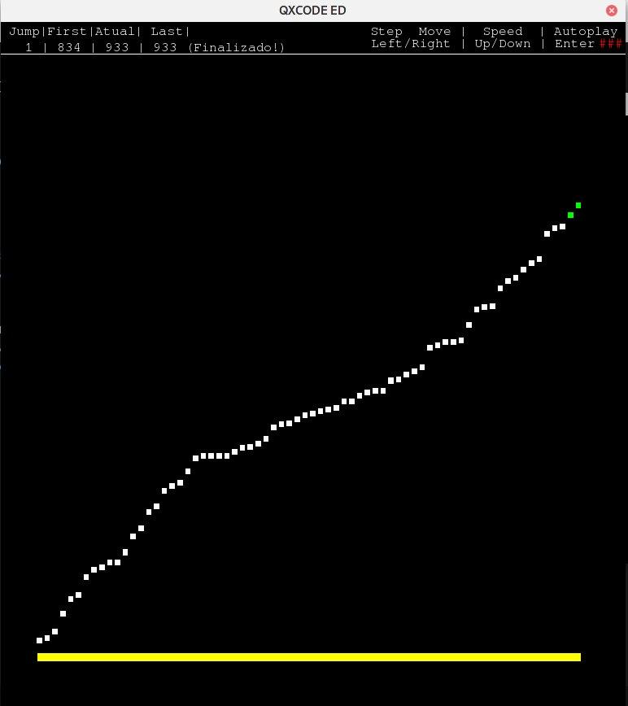

# Merge Sort Visualization

**Número da Lista**: 4<br>
**Conteúdo da Disciplina**: D&C<br>

## Alunos
|Matrícula | Aluno |
| -- | -- |
| 17/0062686 |  Pedro Rodrigues Pereira |
| 17/0008371 |  Daniel de Sousa Oliveira Melo Veras |

## Sobre
O projeto tem como objetivo demonstrar a visualização de pontos com diferentes alturas e sua ordenação a partir de um algoritmo de Merge Sort.

## Screenshots

### Antes da ordenação



### Meio da ordenação



### Dados ordenados




## Instalação 
**Linguagem**: C++<br>
**Framework**: SFML<br>
<br>

1. Primeiro passo é realizar o download do pacote **sfml**.

    1.1. Para sistemas debian e derivados:

    ```
    sudo apt-get install libsfml-dev
    ```

    1.2 Para sistemas arch:

    ```
    sudo pacman -Syu sfml
    ```

2. Logo após se deve realizar o download do repositório com o seguinte comando:

```
$ git clone https://github.com/projeto-de-algoritmos/D-C_MergeSortVisualization.git
```


3. Após o download, acesse a pasta base do projeto:

```
$ cd D-C_MergeSortVisualization
```

3. Agora rode o seguinte comando para compilar o projeto

```
$ make
```

## Uso 
Após compilar o projeto, basta rodar o seguinte comando na raiz do projeto:

```
./prog
```

A partir desse ponto, se faz necessário apertar **Enter** para iniciar a visualização do Merge Sort.
